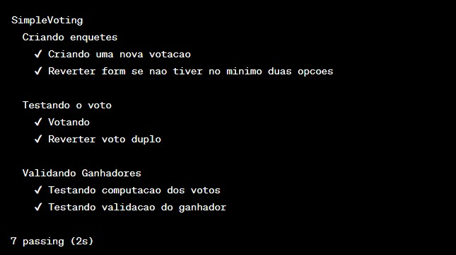

# SimpleVoting Contract Documentation 

## Overview 

O contrato "SimpleVoting" é um contrato Solidity que permite a criação de enquetes, votação em opções e a validação de vencedores em cada enquete. Ele fornece uma estrutura *básica* para conduzir votações simples na blockchain Ethereum. 

## Contrato Solidity 

### Variáveis de Estado 

* **counter**: Um contador público que rastreia o número de enquetes criadas. 
* **_tally**: Um mapeamento privado que armazena os totais de votos para cada opção em cada enquete. 
* **hasVoted**: Um mapeamento que rastreia se um endereço já votou em uma determinada enquete. 
* **_ballots**: Um mapeamento privado que armazena os detalhes de cada enquete. 

### Struct Ballot 

> Uma estrutura que representa uma enquete com campos como pergunta, opções, início e duração. 

**Funções Principais** 

* **createBallot**: Permite a criação de uma nova enquete. 
* **cast**: Permite que um endereço vote em uma opção de uma enquete. 
* **getTally**: Retorna o total de votos em uma opção de uma enquete. 
* **results**: Retorna um array com os totais de votos em todas as opções de uma enquete. 
* **winners**: Retorna um array de booleanos indicando as opções vencedoras de uma enquete. 

## TypeScript Tests Documentation 

**Visão Geral** 

> Os testes em TypeScript validam o funcionamento do contrato "SimpleVoting" em diferentes cenários. Eles são usados para garantir que o contrato se comporte conforme o esperado. 
  
**Testes de Grupo** 

* "Criando enquetes": Testes relacionados à criação de enquetes. 

* "Testando o voto": Testes relacionados à funcionalidade de votação. 

* "Validando Ganhadores": Testes relacionados à validação dos resultados das enquetes. 

**Função deploy**

> Uma função auxiliar que implanta o contrato "SimpleVoting" antes de cada teste. 

**Testes Individuais** 

* "Criando uma nova votação": Testa a criação bem-sucedida de uma nova enquete. 

* "Reverter form se nao tiver no minimo duas opcoes": Testa a rejeição da criação de uma enquete com menos de duas opções. 

* "Votando": Testa a votação bem-sucedida em uma enquete. 

* "Reverter voto duplo": Testa a rejeição de votos duplicados em uma enquete. 

* "Testando computação dos votos": Testa o cálculo correto dos votos. 

* "Testando validação do ganhador": Testa a validação dos vencedores da enquete.  

**Testes Esperados**

Contribuições são bem-vindas! Sinta-se à vontade para melhorar este contrato e adicionar recursos adicionais ou correções aos testes. 